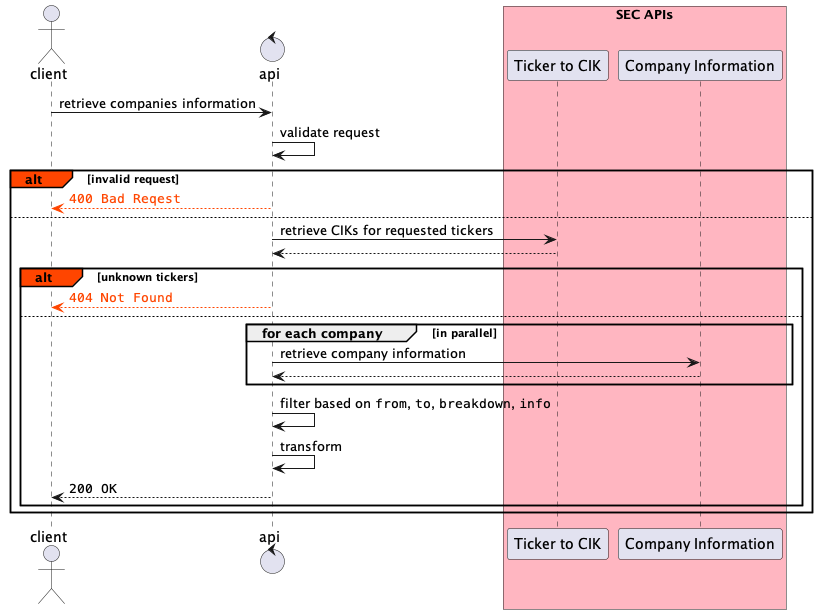

# Comparing Interaction Styles

The objective is to compare the way the code is written depending on the interaction style chosen.

We use [Spring Boot](https://spring.io/projects/spring-boot) and implement:

1. a very simple API to retrieve a list of courses that are stored in a CSV file,
2. a slightly more complex API to retrieve company information from the SEC:  

## Main Differences

| Style                           | Controller return type                                          | Service return type               | Exception handling                                 | Testing                                                                                                                 |
|---------------------------------|-----------------------------------------------------------------|-----------------------------------|----------------------------------------------------|-------------------------------------------------------------------------------------------------------------------------|
| [Synchronous API](./api-sync)   | `ResponseEntity<List<CourseRepresentation>>`                    | `List<Course>`                    | try / catch & `ResponseEntityExceptionHandler`     | [`MockMvc`](https://docs.spring.io/spring-framework/docs/current/reference/html/testing.html#spring-mvc-test-framework) |
| [Asynchronous API](./api-async) | `CompletableFuture<ResponseEntity<List<CourseRepresentation>>>` | `CompletableFuture<List<Course>>` | `exceptionally` & `ResponseEntityExceptionHandler` | [`MockMvc`](https://docs.spring.io/spring-framework/docs/current/reference/html/testing.html#spring-mvc-test-framework) |
| [Reactive API](./api-reactive)  | `ResponseEntity<Flux<CourseRepresentation>>`                    | `Flux<Course>`                    |                                                    | [`WebTestClient`](https://docs.spring.io/spring-framework/docs/current/reference/html/testing.html#webtestclient)       |
|                                 |                                                                 |                                   |                                                    |                                                                                                                         |

Note that since there is no semantic difference between an empty list of courses and no list at all, the service return type is not wrapped in an `Optional`.  

## Structure

The project is structured as follows :

* [Synchronous API](./api-sync)
* [Asynchronous API](./api-async)
* [Reactive API](./api-reactive)

We decided to create a module per type, in part because of what is mentioned in the [Spring Boot Reference Documentation](https://docs.spring.io/spring-boot/docs/2.7.3/reference/htmlsingle/#web.reactive):

> Adding both `spring-boot-starter-web` and `spring-boot-starter-webflux` modules in your application results in **Spring Boot auto-configuring Spring MVC, not WebFlux**. ... You can still enforce your choice by setting the chosen application type to `SpringApplication.setWebApplicationType(WebApplicationType.REACTIVE)`.

## Pre-requisites

### Software

The following should be installed locally :

* [Java 16](https://openjdk.org/projects/jdk/16/)
* [Maven 3.6](http://maven.apache.org/) or later

### Build

The project is built using [Maven](https://maven.apache.org).

## Run

Each module can be run in the same manner.

Here are the instructions for the `api-sync` module.

### Command Line

* Build and package

> `mvn clean package`

* Start the service

> `cd api-sync`
> `java --enable-preview -jar target/api-sync.jar`

The server port is `9000` as specified in the [application configuration](./api-sync/src/main/resources/application.yaml).

* Access the API

> `curl -i 'http://localhost:9000/sync/courses?departmentCode=POL'`

if you have [`json_pp`](https://www.unix.com/man-page/osx/1/json_pp/), you can pretty print the result:

> `curl -X GET 'http://localhost:9000/sync/courses?departmentCode=POL' | json_pp`

* Debug

If you need to debug the service, use the following command to start the service

> `java -Xdebug -Xnoagent -Xrunjdwp:transport=dt_socket,address=8000,server=y,suspend=n -jar target/api-sync.jar`

then connect a remote debugging session to port `8000`

* Profile using Java Mission Control

Download Java Mission Control from [here for OpenJDK](https://jdk.java.net/jmc/) or [here for Oracle](https://www.oracle.com/technetwork/java/javaseproducts/downloads/jmc7-downloads-5868868.html) since it's not part of the JDK 11 anymore.

If you need to profile the service, use the following command to start the service

> `java -XX:+FlightRecorder -jar target/api-sync.jar`

For offline profiling use

> `java -XX:+FlightRecorder -XX:StartFlightRecording=duration=200s,filename=flight.jfr -jar target/api-sync.jar`

## To Do

* Implement Reactive ( 204 when no courses + exception handling )
* Add Virtual Thread style
* Add an API with 2 parallel calls
* Add a database call and an API call
* Add a client using the JDK's HttpClient
* Add tests for error cases